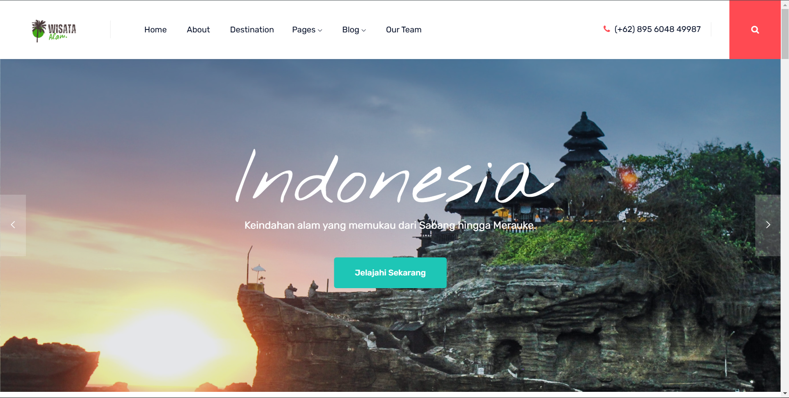

# 🌿 Website Wisata Alam

Selamat datang di **Website Wisata Alam**, platform interaktif untuk menjelajahi keindahan alam Indonesia. Temukan destinasi terbaik, baca ulasan, dan rencanakan perjalanan Anda dengan mudah.

---

## 📸 Preview
  
*Tampilan utama website kami yang ramah pengguna dan memukau secara visual.*

---

## ✨ Fitur Utama

- **Home**: Halaman utama yang menampilkan destinasi wisata populer berdasarkan kategori seperti pantai, gunung, hutan, danau, atau taman nasional. Pengguna dapat langsung menemukan rekomendasi terbaik di halaman ini.  
- **About Us**: Menyediakan informasi tentang visi dan misi website, cerita di balik pembuatannya, serta tujuan untuk mempromosikan keindahan wisata alam Indonesia.  
- **Destination**: Katalog lengkap destinasi wisata dengan detail seperti deskripsi, fasilitas, galeri foto, dan ulasan pengunjung. Fitur pencarian mempermudah pengguna menemukan tempat sesuai keinginan.  
- **Pages**: Berisi halaman tambahan seperti FAQ, panduan wisata, dan informasi penting lainnya untuk membantu pengunjung.  
- **Blog**: Koleksi artikel menarik, seperti tips mendaki gunung, panduan eco-tourism, serta rekomendasi perjalanan untuk berbagai jenis wisatawan.  
- **Our Team**: Mengenal tim di balik website ini, termasuk desainer, pengembang, dan kontributor lainnya yang membantu menghadirkan pengalaman terbaik bagi pengguna.


---

## 🚀 Instalasi

Ikuti langkah berikut untuk menjalankan proyek ini secara lokal:

1. **Clone repository ini**:
   ```bash
   git clone https://github.com/bgwahyoe/project-website-wisata-alam.git
